<p align="center">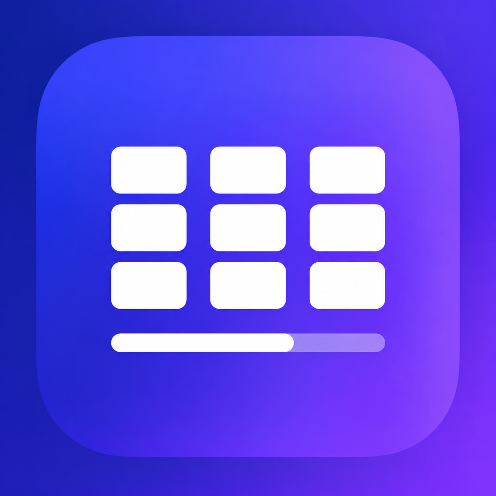</p>

<p align="center"><a href="README.md">English</a> | <b>简体中文</b></p>

# Notebase

**为你的笔记提供项目状态、Wiki 页面和数据库。本地运行，保护隐私。**

Notebase 让你一眼看清每个项目的**原则、待办、已完成的工作和验证范围**，并提供类似工作区的页面、数据库、模板、
关联、快速查找以及 CSV/Markdown 导入导出。所有内容都以普通 Markdown 保存在你自己的库中。

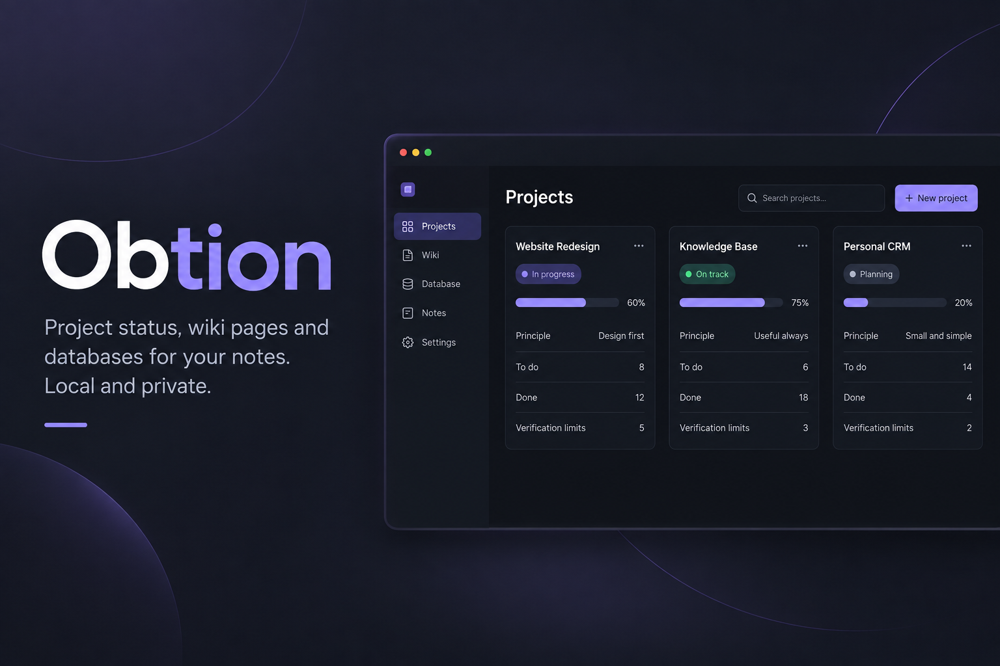
<sub>示意图。真实截图见下文。</sub>

- **按需加入：** 只读取或修改你在所选工作区文件夹（默认 `Notebase/`）中用 `kit: <kind>` 标记的笔记。
- **以人为先：** 下一步、截止日期、负责人、状态、决策、相关笔记和验证信息排在最前。内部记录（AI、会话、token
  或日志属性）默认隐藏，除非你手动开启。
- **从不编造数据：** 缺失的负责人或截止日期显示为 **Not set**（未设置）。
- **视图由你决定：** 显示或隐藏字段、调整顺序、筛选和排序，选择会被保存。

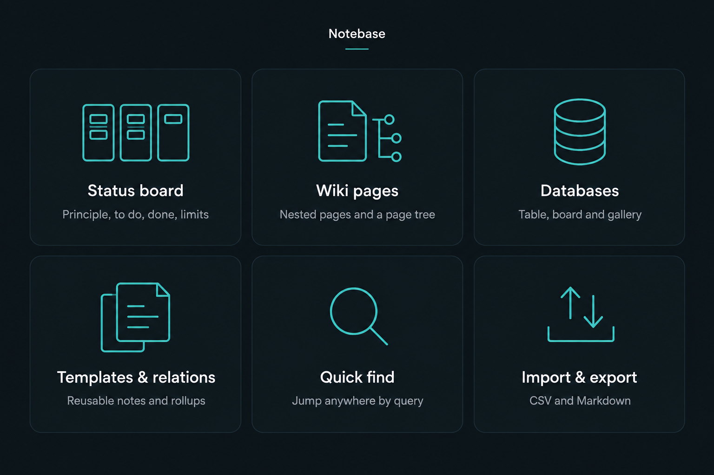

## 截图

界面目前为英文。

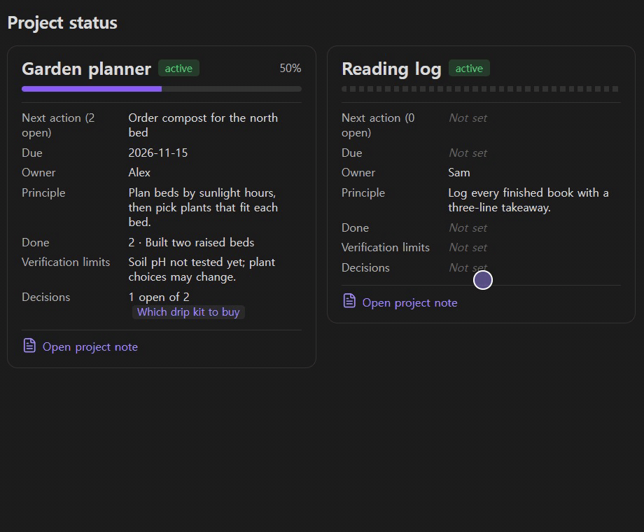

| 状态看板 | 自定义 |
|---|---|
| 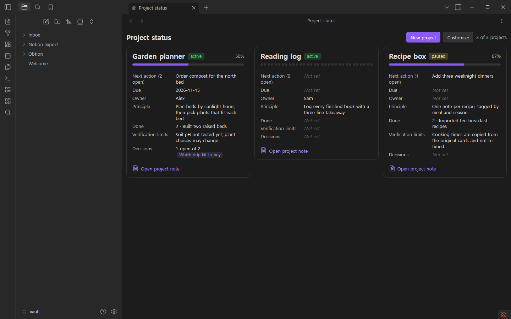 | 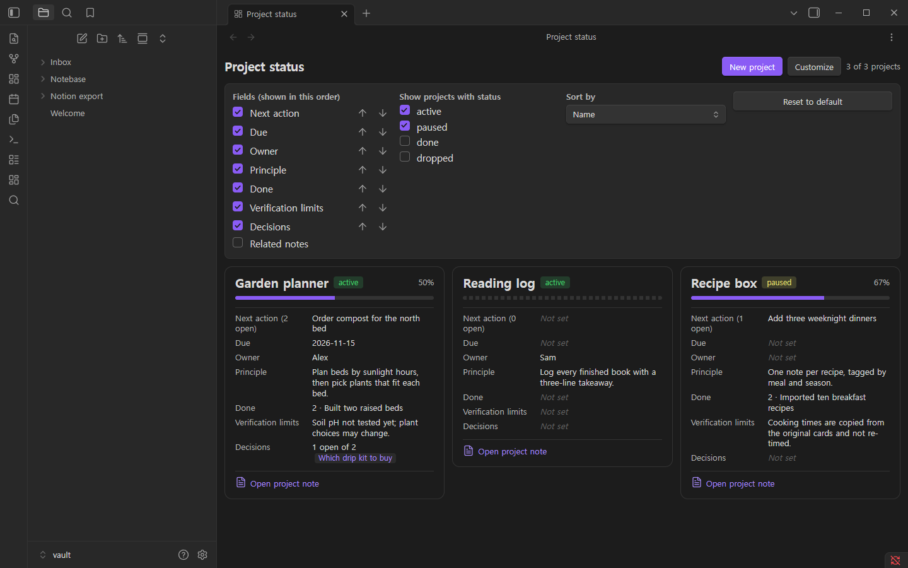 |

| Wiki 页面与页面树 | 关联与汇总 |
|---|---|
| 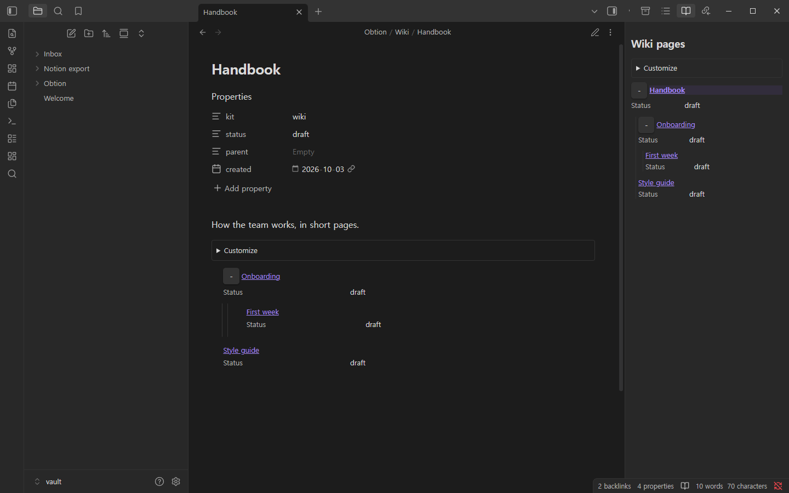 | 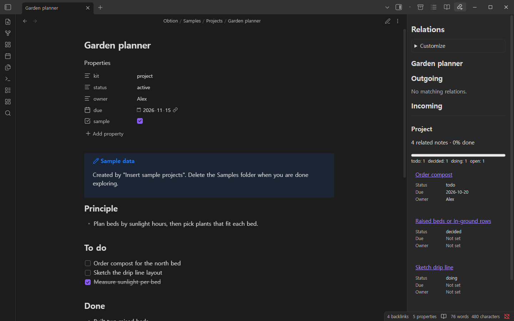 |

| 数据库：表格 | 数据库：看板 | 数据库：画廊 |
|---|---|---|
| 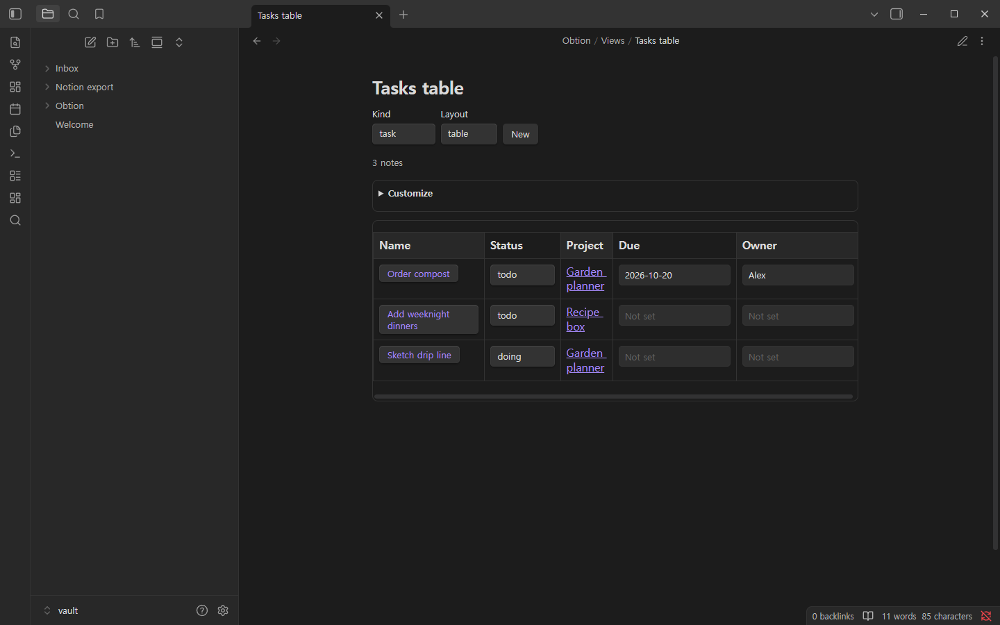 | 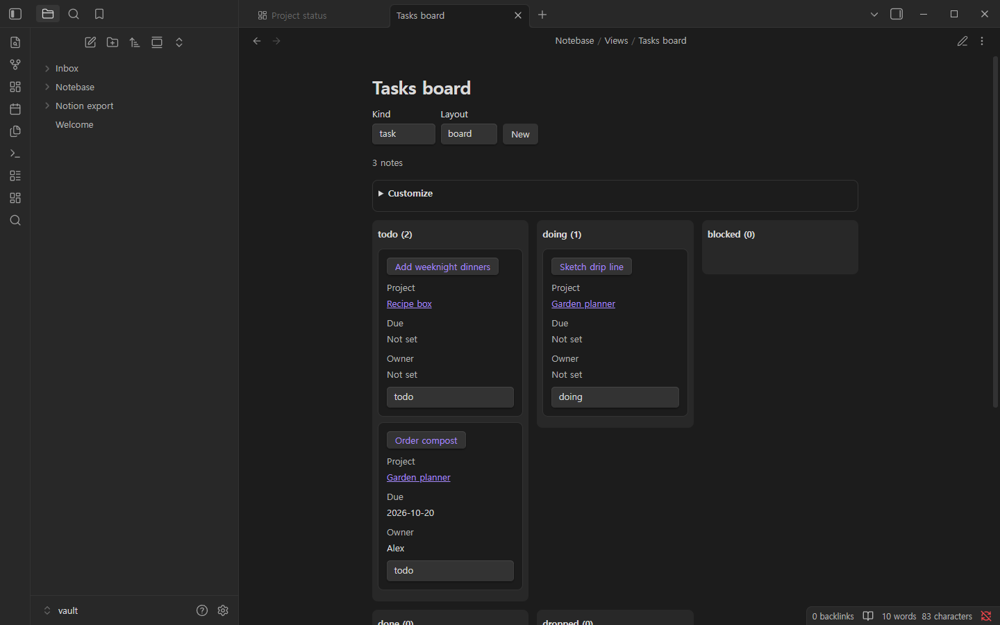 | 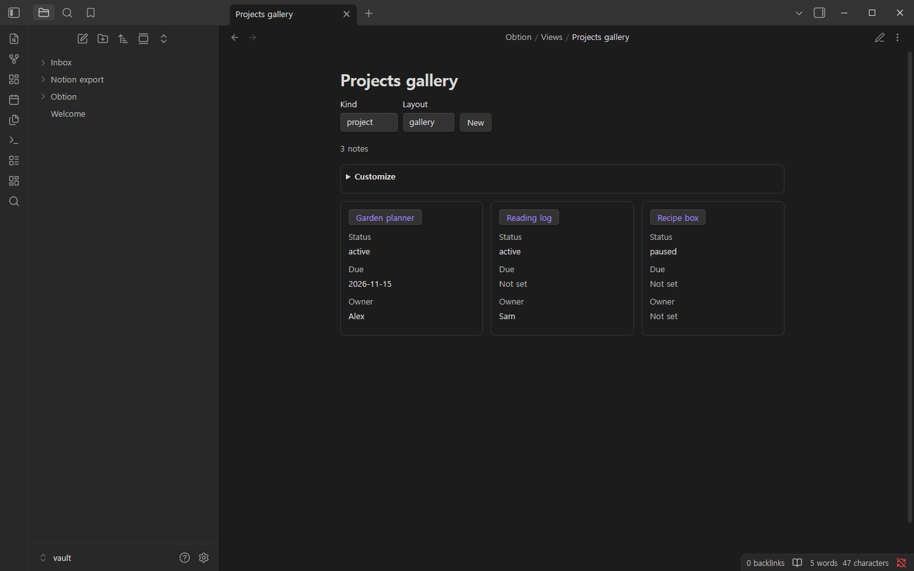 |

| 模板 | 快速查找 |
|---|---|
| 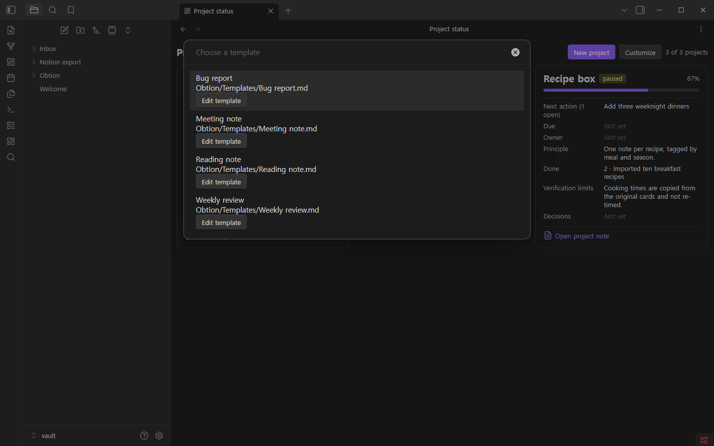 | 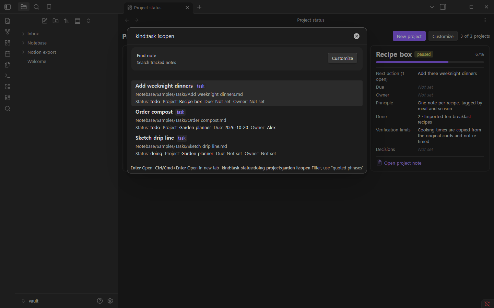 |

| 导入 Notion 导出文件 | 导出 |
|---|---|
| 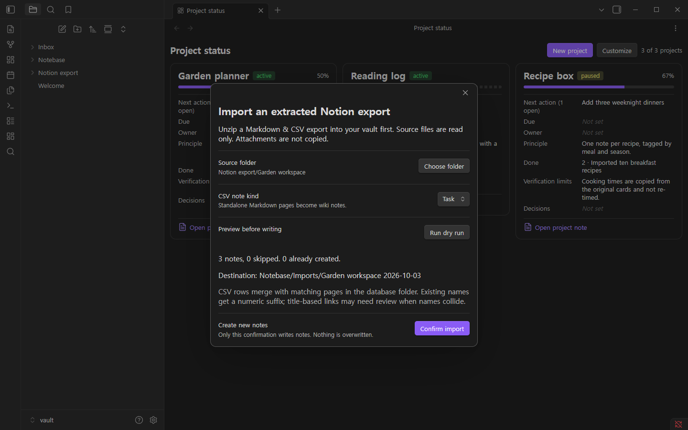 | 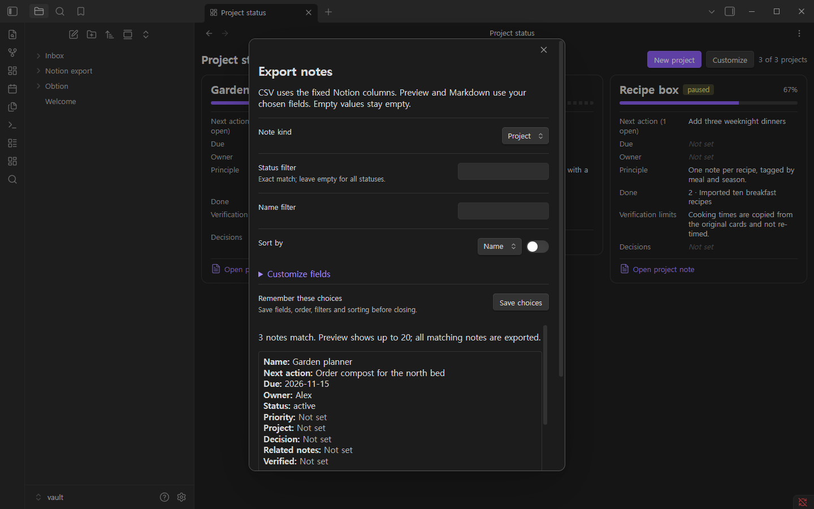 |

## 安装

- **手动安装：** 从[最新版本](https://github.com/Hakubisual/notebase/releases/latest)下载 `main.js`、`manifest.json`
  和 `styles.css`，放入 `<vault>/.obsidian/plugins/obtion/`，然后在 设置 → 第三方插件 中启用 **Notebase**。
- **BRAT（测试版）：** 在 BRAT 插件中添加 `Hakubisual/notebase`。
- **社区插件市场：** [社区目录中的 Notebase](https://community.obsidian.md/plugins/obtion)。

插件 id 为 `obtion`（项目的早期名称），因此插件文件夹是 `.obsidian/plugins/obtion/`。为 0.1.0 编写的代码块
（`obtion-status`、`obtion-db`、`obtion-children`、`obtion-breadcrumb`、`obtion-rollup`）仍可正常显示。如果你使用
0.1.0 时没有改过设置，会继续使用原有的 `Obtion/` 工作区文件夹。

需要 Obsidian 1.7.2 或更高版本。

## 快速开始

1. 命令面板 → **Notebase: Insert sample projects**，用示例数据体验（写入 `Notebase/Samples/`），或
   **Notebase: Create project** 新建项目。
2. 命令面板 → **Notebase: Open project status board**（或点击侧边栏的仪表盘图标）。
3. 点击 **Customize**，选择要显示的字段、字段顺序、显示哪些状态以及排序方式。

## 笔记结构

Notebase 笔记就是带 frontmatter 的普通 Markdown 笔记：

```yaml
---
kit: project        # project | task | decision | wiki | record
status: active      # 项目：active, paused, done, dropped
owner: Alex         # 可选；留空则显示 "Not set"
due: 2026-11-15     # 可选
---
```

任务和决策通过 `project: "[[Garden planner]]"` 关联到项目。项目笔记包含四个小节（标题可在设置中重命名）：

```markdown
## Principle
- 这个项目如何运作。
## To do
- [ ] 下一步
## Done
- 已完成的内容，以及证据所在位置
## Verification limits
- 尚未验证的内容及原因
```

## 功能

### 状态看板
每个项目一张卡片，显示状态、进度（已完成与未完成条目之比；没有任何记录时显示虚线进度条）以及你选择的字段。
在任意笔记中用 `notebase-status` 代码块嵌入看板。命令：**Open project status board**、**Create project**、
**Create task**、**Create decision**（自动选中当前项目）、**Insert sample projects**。

### Wiki 页面
**Create wiki page** 和 **Create wiki subpage**（会添加 `parent` 链接）。侧边的 **Wiki pages** 视图显示页面树。
代码块：`notebase-children` 列出子页面（`depth: 2` 表示两层）；`notebase-breadcrumb` 显示到顶层页面的路径。

### 数据库
在任意笔记中添加代码块：

````markdown
```notebase-db
kind: task          # project | task | decision | wiki | record
layout: board       # table | board | gallery
filter:
  - property: status
    op: in          # equals | in | contains | empty
    value: [todo, doing]
sort:
  - property: due
    direction: asc
columns: [status, project, due, owner]
```
````

可以直接修改状态、编辑文本属性、用 **New** 新建笔记，并用 **Customize** 保存字段设置。
**Open database view** 会在单独的标签页中打开同一个数据库。

### 模板与关联
模板文件夹位于工作区文件夹内（默认 `Templates`）。**Install starter templates** 会添加会议记录、每周回顾、
缺陷报告和读书笔记模板。**New note from template** 会填充 `{{title}}`、`{{date}}`、`{{time}}`、`{{project}}`、
`{{parent}}` 和 `{{folder}}`。侧边的 **Relations** 视图显示当前笔记的入链和出链以及汇总（按状态计数、完成百分比）；
`notebase-rollup` 代码块可在笔记内显示同样的内容。

### 快速查找
**Find note** 支持筛选条件 `kind:task`、`status:doing`、`project:garden`、`is:open` 和 `"带引号的短语"`；
按 Enter 打开，Ctrl/Cmd+Enter 在新标签页打开。另有 **Go to project**、**Next open task**、**Find in project**
和 **Recent notes**。

### 导入与导出
- **导入 Notion 导出文件：** 把 Notion 的 "Markdown & CSV" 导出解压到库中，选择该文件夹，先试运行预览，再确认。
  新笔记写入 `Notebase/Imports/<文件夹> <日期>/`；源文件不会被修改。
- **导出笔记：** 在 `Notebase/Exports/` 写入 CSV（UTF-8 带 BOM）和 Markdown 表格。

`templates/notion` 文件夹包含一个示例导入包（CSV 和 Markdown），可用 Notion 自带的导入工具重建相同布局。

## 搭配 AI 助手效果更好

Notebase 把所有内容保存为普通 Markdown，并使用一小套严格的 frontmatter 约定。任何能读写你库中文件的助手
（Codex、Claude、Cursor、Copilot、本地模型）都可以创建项目、保持状态最新、撰写每周总结并建议下一步，同时看板
依然便于人阅读。

- 把 [`examples/ai/AGENTS.md`](examples/ai/AGENTS.md) 中的规则交给助手：复制到库的根目录（Claude Code 另存一份
  `CLAUDE.md`），或把 [`examples/ai/notebase.mdc`](examples/ai/notebase.mdc) 用作 Cursor 规则。
- 现成的提示词：[`examples/ai/prompts.md`](examples/ai/prompts.md)。完整指南（含中文摘要）：
  [`docs/AI-GUIDE.md`](docs/AI-GUIDE.md)。

核心规则：只使用定义好的状态值；面向人的字段（`owner`、`due`、`project`、`verified`）只填已知的值，其余留空；
没有可打开的证据绝不标记为已完成或已验证；绝不覆盖、重命名或删除笔记；助手自己的记录写入内部字段（`session`、
`model`、`tokens`、`log`），Notebase 默认隐藏这些字段；批量修改前先提出方案。

## 隐私与安全

- **不联网、无遥测、无需账号、无广告。**
- 只在你的库内读写，并且只在工作区文件夹内。不能选择整个库、隐藏文件夹或包含 `..` 的路径。
- 新文件会使用未被占用的名称（如 "Reading list 2"），**绝不覆盖**已有文件。
- 只修改以已知 `kit` 类型加入的笔记的 frontmatter。从不删除或重命名笔记。
- 停用或卸载后所有笔记保持不变。卸载还会删除 Notebase 保存的视图偏好。

## 限制

参见 [`docs/FEATURE-MATRIX.md`](docs/FEATURE-MATRIX.md)。不包含：实时协作、评论、分享、API 同步、公式、
时间线/日历视图、ZIP 导入。尚未在移动设备或浅色主题上测试。

## 开发

```bash
npm install
npm run dev        # 监听构建
npm run typecheck && bun test && npm run build && npm run lint
npm run package    # 校验 manifest/versions，并在 dist/<version>/ 生成发布文件和 zip
```

架构：[`docs/ARCHITECTURE.md`](docs/ARCHITECTURE.md)。发布流程：[`docs/RELEASING.md`](docs/RELEASING.md)。

## 许可证

[MIT](LICENSE)
